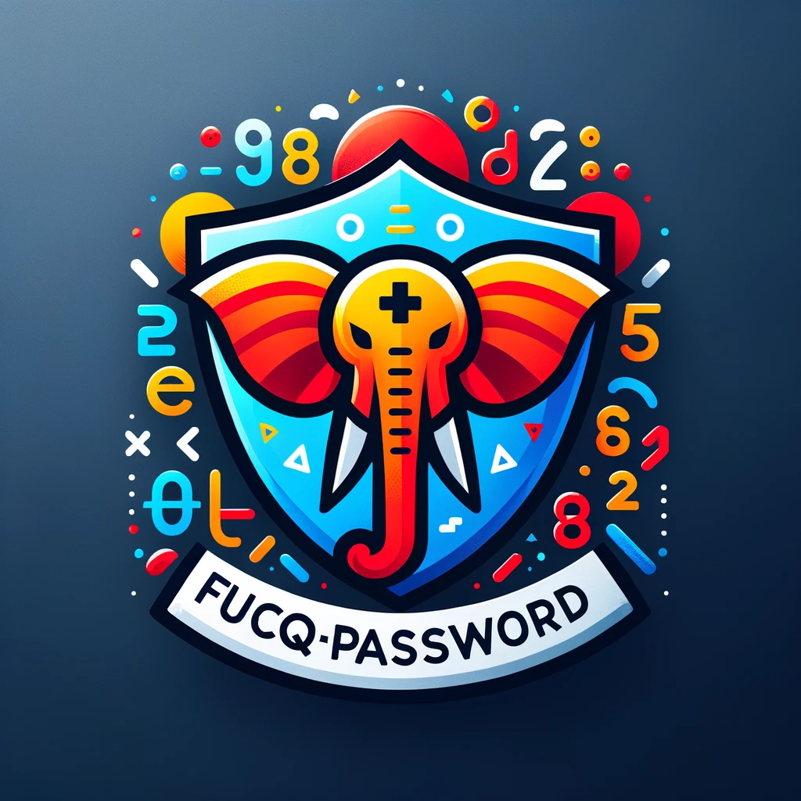

# FucqPassword Class

 

## Introduction
`FucqPassword`, standing for **Flexible, Unique, Creative, and Quick Password**, is a pioneering PHP class that combines advanced technology and linguistic creativity to generate highly secure, unique, and memorable passphrases. It integrates OpenAI's GPT-4 to analyze and rank these passphrases based on their complexity, readability, entropy, and memorability. This class is a significant stride in enhancing cybersecurity through innovative passphrase generation.

**Author:** Tristan McGowan  
**Contact:** tristan@ipspy.net

## Key Features
- **Diverse Passphrase Generation:** Constructs passphrases from a rich mix of adjectives, animals, actions, directions, days of the week, times of day, and locations, ensuring each passphrase's uniqueness and creativity.
- **AI-Driven Analysis with GPT-4:** Employs OpenAI's GPT-4 for comprehensive analysis, evaluating various aspects like complexity, readability, sentiment, and linguistic patterns.
- **Entropy and Memorability Scoring:** Each passphrase is evaluated for its unpredictability and ease of recall, providing scores that guide users in choosing strong yet memorable passphrases.
- **RESTful API Interface:** Facilitates easy integration with external systems, allowing for broader application in various digital environments.
- **API Key Management:** Implements a robust system for generating and validating secure API keys necessary for accessing the class's functionalities.

## Installation and Setup
1. Clone or download the FucqPassword repository.
2. Ensure PHP (version 7.4 or higher) is installed on your server.
3. Include `FucqPassword` and its dependencies in your PHP project.

## Generating an API Key
To access the REST API, first generate an API key:
```php
require_once 'FucqPassword.php';
$generator = new FucqPassword();
echo $generator->generateApiKey();
```
This key is crucial for authenticating and utilizing the REST API functionalities.

## Usage

### Generating Passphrases
To create a new passphrase:
```php
require_once 'FucqPassword.php';
$generator = new FucqPassword();
echo $generator->generatePassphrase();
```

### REST API Integration
Make a GET request to `index.php` with the following parameters:
- `seedPhrase` (optional): A specific passphrase for analysis.
- `fpapikey`: Your unique FucqPassword API key.

Example request:
```bash
curl "http://yourserver.com/FucqPassword/index.php?seedPhrase=your_seed_phrase&fpapikey=your_api_key"
```

## Understanding AI-Driven Analysis
- **AI Variability:** The AI's nature means results may vary for the same passphrase upon repeated analyses.
- **Scores and Rankings:** Passphrases are scored and ranked on entropy and memorability, balancing security and usability.
- **Pattern Recognition:** GPT-4 identifies and analyzes linguistic patterns, providing an additional layer to passphrase evaluation.

## Complexity and Caveats
- **Analysis Depth:** While GPT-4 offers a deep analysis, it may not fully align with human judgment due to its algorithmic nature.
- **AI Limitations:** GPT-4's interpretations, though advanced, might not capture all nuances of human language.
- **Score Interpretation:** The provided scores should be seen as guidelines, emphasizing a balance between security and ease of use.

## Example Returns
### Sample Analysis and Ranking
```json
{
  "seedPassphrase": "The agile dolphin swims northward every Friday at dawn to explore the castle.",
  "analysis": {
    "length": 17,
    "syllables": 23,
    "word_count": 13,
    ...
  },
  "rankedPassphrases": [
    {
      "passphrase": "The swift shark glides southward each Thursday at dusk to discover the fortress.",
      "entropy_score": 7.5,
      "memorability_score": 8.2,
      ...
    },
    ...
  ]
}
```

## Security Considerations
- Securely store all API keys.
- Protect all sensitive files, especially those containing API keys, from web access.

## Dependencies
- PHP 7.4 or higher.
- Access to OpenAI's GPT-4 API.

## Contributing
We welcome contributions. Fork the repository and submit pull requests for any enhancements.

## License
FucqPassword is released under the MIT License.

## Contact
For more information or support, reach out to Tristan McGowan at tristan@ipspy.net.

*This README.md provides an in-depth guide to the FucqPassword class, highlighting its integration with AI for advanced passphrase analysis and generation. The document covers installation, usage, API integration, and security considerations, making it a comprehensive manual for users and developers alike.*
